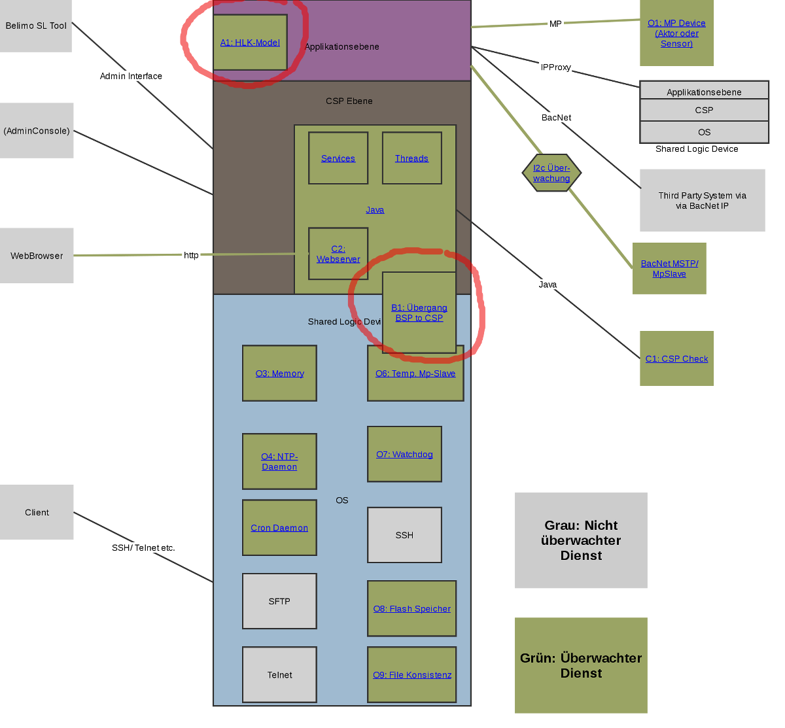
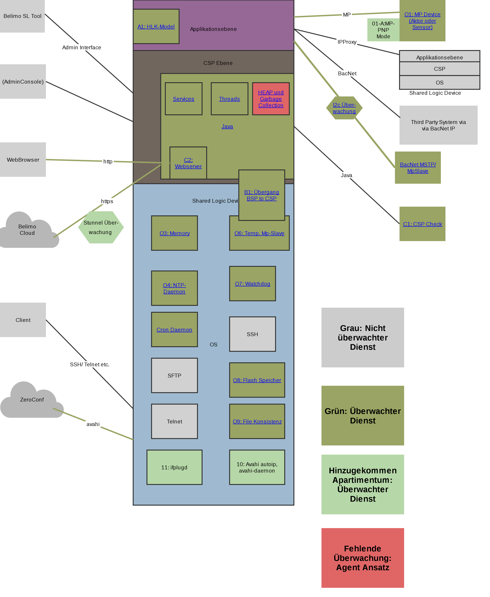

# Überwachte Services in sharedlogic

* Aktuell wird das EV2 mit der CSP Version 1.33.5 produziert. Diese enthält nicht alle bekannten Verbesserungen an der Watchdog Infrastruktur.
* Einige wenige spezial EV2 (6 Wege IPV) werden mit der CSP Version 2.2.2 produziert
* Alle Versionen sind vom Jetty Memory Leak betroffen

***

# CSP 1.33.5

***

# CSP 2.2.x

***

# Aktuell CSP 2.8.0 (Apartimentum)

