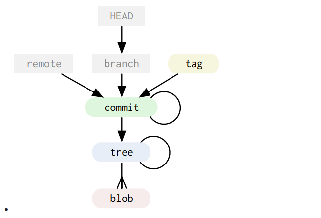

## git gud
### or a semi-deep dive into git internals and 'advanced' use cases

> I apologize for the use of console tools in this talk, but it's the single UI that works (for me) across all platforms.

***

# Git internals

It used to be called the stupid content tracker for a reason:

* git only knows *4 main object* types
* all of them are stored in the *object database*
* the database is store in the *git database*
* all objects are compressed using `zlib` and referenced by the SHA of it's content and a small header.

***

## The blob

In git the contents of files are stored as *blobs*.

    # in your working directory                   in git's object db
    .
    ├── build.gradle.kts                      --> blob: b14c5
    ├── gradle
    │   └── wrapper
    │       ├── gradle-wrapper.jar            --> blob: 76433
    │       └── gradle-wrapper.properties     --> blob: f6532
    ├── (...)
    └── show-files.sh                         --> blob: c5632

It's important to note that the contents are store, not the files. This way,
if a file content exists twice or needs to be transfered, it only needs to be done once. 

***

## The tree

Trees are pointers to other trees and blobs.

       # in your working directory                   in git's object db
       .                                         --> tree: 86866
       ├── build.gradle.kts                      
       ├── gradle                                --> tree: 37131
       │   └── wrapper                           --> tree: b6722
       │       ├── gradle-wrapper.jar            
       │       └── gradle-wrapper.properties    
       ├── (...)
       └── show-files.sh                     

Tree are simple lists of trees and blobs that tree contains along with the  (unix) modes of theses.  

***

## The commits

Storing arbitratry trees is cool, but where is the history?

Commits store history!

    commit 211\0
    
    tree 4b825dc642cb6eb9a060e54bf8d69288fbee4904
    author Silvio Heuberger <silvio.heuberger@beekeeper.io> 1546941528 +0100
    committer Silvio Heuberger <silvio.heuberger@beekeeper.io> 1546941528 +0100

    Initial commit

***

## A second commit

Later commits in history can have *multiple* parents.

    commit 261\0

    tree 863420c0e98ee71d9b8135139185d6e3d9b88797
    parent 57dbc81343cf8aa344703a4ed3e8fa69b8aa3235
    author Silvio Heuberger <silvio.heuberger@beekeeper.io> 1546954478 +0100
    committer Silvio Heuberger <silvio.heuberger@beekeeper.io> 1546954478 +0100

    Add some more content

***

## Tags

The final object type are *tags*, which are basically shorthand names for a specific commits.

    tag 167\0

    object a26620a6a8e1738735afd4d38a407bd3501271ec
    type commit
    tag 0.0.0
    tagger Silvio Heuberger <silvio.heuberger@beekeeper.io> 1546955136 +0100

    Initial tagged version

Tags are different from branches, which also point to commits. Unlike branches, they are also stored as objects.

***

# The data model

The git object data forms a *directed acyclic graph*. All of the objects are *immutable*.

## References

References are the things that constantly changed, while you're working on a repository.

* Your currently checked out state, called HEAD
* branches
* remotes

A branch is nothing more than a simple file stored in `.git/refs/heads/` with the SHA of the commit it points to.

***

# The data model (contd.)

    colored: immutable, expensive objects
    grey:    cheap, mutable pointers to commits

***

# Demo time

***

## Creating and navigating history

* You have a repo and want to make sense of it's history
* Tools to use
  * `git log --decorate --graph --all`
  * `gitg`
  * `tig`

***

## Amending a commit

You already commited, but need to add some more changes?

* `git commit --amend`
* Edit the last commit and recommit (optionally) with a new message.

***

# Stashing changes / commiting half of them

You worked on multiple things at the same time 😔. Now you need to sort out the mess 😊.

* Tools like `tig` or `gitg` are your friend when staging individual *hunks*.
* Stage part of the files using one of the tools.
* `git stash save "My horrible mess"`
* `git stash list -p`
* Even though the stash is a stack (you can `pop` from it), you can also apply from lower 'registers'.

***

## Cherry picking

You have commits on one branch, you want on another one as well. (for example a hotfix).

* `git checkout {target-branch}`
* `git cherry-pick {the-commit-you-want}`

or

* `git cherry-pick feature/some-feature feature/some-feature~4`
   cherry pick a range of commits

***

## Rebasing a branch on top of another one

You have work on a feature-branch and `master` has moved along.

* What does this rebase thing even mean?
  * Transplating commits to another part of the history
  * Kind of *automated cherry-pick*

***

## How to rebase

* `git checkout feature/{feature-branch}`
* `git rebase -i {target-branch}`
* fiddle with the history until satisfied
* run rebase.

***

## Fixing up earlier commits

You have already comitted some stuff earlier on, but no you need to change it later.

* `git commit --fixup={sha}`
* `git rebase -i --autosquash {branch}`

***

## Bulk updates of commits

Want to update all the commit messages on a branch?

* Use `git rebase -i {target-branch}` and edit the rebase todo list:
  * `pick`: Take this commit as is
  * `reword`: Rewrite the message of this commit
  * `edit`: Stop and edit the commit and (potentially) the message
  * `skip`: Skip the commit
  * (...)

***

## Finding the commit where something broke

* `git bisect` is your friend
* mark commits as `good` or `bad` and do binary search to find the first bad one
* (if you have tests to prove it): `git bisect run ./gradlew test`

***

## Tags

Tags are stored in the obect database and thus are *immutable*. Usually, you'll never want to move tags around.

You create these tags using

    git tag -a 0.1.1 -m "Releasing 0.1.1 now"

## Lightweight tags

Lightweight tags on the other hand are stored (like branches) in `.git/refs/tags` and are mutable (not desirable).

You can create them using

    git tag 0.1.1

***

## Describing where you're at

    git describe --tags --always --long

***

# Submitted questions

*** 

## What do I do, if I fuck up?

- You can always `git rebase --abort` on bad rebase, `git cherry-pick --abort` ...
- You can always `git reset --hard` if you commited your work
- `git reflog`
- Remove sensitive data from a branch (`--fixup`)

***

# Questions? 🤔

***

# Excersises left to the reader

## Install completions

* for your `zsh` or `bash` or whatever: install git completions!

***

## `git filter-branch`

The BFG of git, basically walk over the history and rewrite entire branches.

> Please don't. If you absolutely must, do make backups before and progress with extreme caution!

