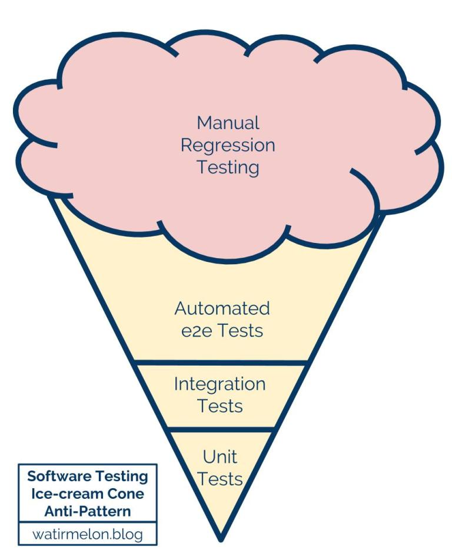
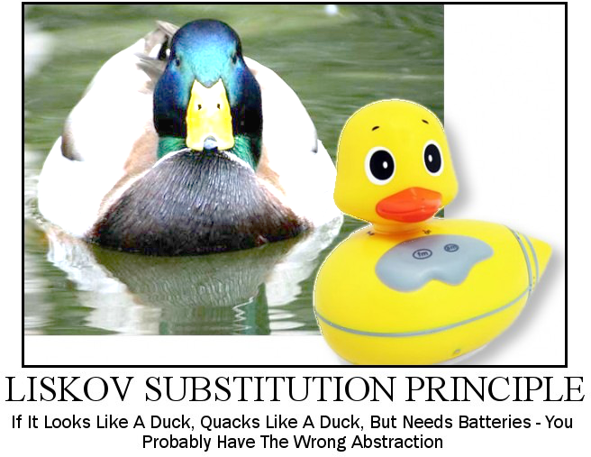

# Refactoring to tests
## Or: How can tests provide design feedback?
## Or: What tests do we want to write?

***

## So what do I even mean?

Good code with good design (on the API/component/class level) should be _easy_ and _fast_ to test.

Test code should be treated with the same care as all other code is; after all tests are your safety net when changing things.

The simplicity of testing something (or lack thereof) can be seen as direct systems design feeback and as such provides additional value over the mere checking of things working.

***

## On test automation

Why do we automate?


***

## The testing pyramid


[Martin Fowler, Practical Testing Pyramid][1]

***

## The testing pyramid

While a great metaphor, it falls short in some areas:

- naming is quite vague
- a bit simplistic
- just call your tests 'service tests' and you're okay.

Other people tried different naming and other improvements, but the idea remains the same.

***

## 👍 What we want

- good coverage
- blazing fast to run
- simple to maintain
- simple to add new test cases

***

## 👍 What we want

Ground rules:

1. Write tests with different granularity.
2. The more high-level you get, the fewer tests you should have.

*** 

## 👍 What we want

In different words:

> Stick to the pyramid shape to come up with a healthy, fast and maintainable test suite: Write _lots_ of small and fast _unit tests_. Write _some_ more _coarse-grained tests_ and _very few_ high-level tests that test your application from _end to end_. 
&mdash; <cite>[Martin Fowler][1]</cite>

***

## 👎 What we don't want




***

## ☑ On the subject of unit tests 

What is a unit anyway?

There really is not solid definition and there need not be.

In a functional language it might be one single function, in an object-oriented language it is probably more like a single class instance.

***

## Solitary and sociable unit tests

TBD

***

## Making code testable

From [SOLID principles][4]

- *S*ingle responsibility principle
- *D*ependency inversion principle

***

## Single responsibility principle

A class (can also be a function) should have a single responsibility. In [Uncle Bob][3]'s terms, it should only have _one and only one reason to change_.

***

## Employee

```java
public class Employee {
  public Money calculatePay() {}
  public String reportHours() {}
  public void save() {}
}
```

Reasons to change:

- Salary spec changes
- Reporting format changes
- Database schema or how to talk to it changes
- ...

***

## Employee (much improved)

```java
public class Employee {
  public Money calculatePay() {}
}

public class EmployeeReporter {
  public String reportHours(Employee e) {}
}

public class EmployeeRepository {
  public void save(Employee e) {}
}
```

These are much better separated into single responsibilities. You can see that the conflicting reasons to change have been separated into separate classes.

***


## Dependency Inversion Principle

> Depend upon Abstractions. Do not depend upon concretions.
&mdash; [Design Principles and Design Patterns][4]

 Every dependency in the design should target an interface, or an abstract class. No dependency should target a concrete class.

***

## Dependency Injection

One of the most common places where you depend on concrete implementations is _instantiation_.

Dependency injection solves this by allowing the concrete instances to be _injected_ into the actual code via a mechanism.

There are frameworks to help you assemble the runtime object graph, but usually we can do it by hand and wire things up that way.

***

## Dependency Injection

```java
public class PaymentProcessor {
  private final CreditCardService paymentService = new CreditCardService(...);

  public Result process(Payment payment) {
    var result = new Result();
    result.with(paymentService.validate(payment));
    if(result.isValid()) {
      return paymentService.process(payment);
    }
    return result;
  }
}
```

- Impossible to replace credit card payments with something else.
- Hard to test without hitting the actual credit card service interface.

***

## Dependency Injection

```java
public interface PaymentService {
  Result validate(Payment payment);
  Result process(Payment payment);
}

public class PaymentProcessor {
  public final PaymentService paymentService;

  public PaymentProcess(PaymentService paymentService) {
    this.paymentService = paymentService;
  }

  public Result process() { /* same as before */ }
}
```

***

## Dependency Injection

Beware of `static` utility helper things: They are impossible to inject/substitute and should in general be steered away from for anything you may want to substitute.

Of course, don't follow this dogmatically but apply some reasoning.

***

## 🕵 Mocks, Stubs, Spies

Once we have dependencies injectable we start talking about _mocking_ and _stubbing_ them for testing.

TBD:

- What are stubs
- What are mocks
- How are they useful


***


# Questions 

***

# Exercise time 

***

## Setup

1. Form groups of 2-3 people, that will pair-/mob-program.
2. Grab a computer
3. Clone Exercise repo: 

***

## Exercise 1

1. Find out what tests exist.
2. Discuss what type of tests they are and what they are actually testing.
3. Share back

***

## Exercise 2

1. Can you restructure the code so it can be tested more easily?
2. Give it a try and refactor the tests along with the changes.

***

## 

# 

# The End

***

# Sources

A lot of stuff is from Martin Fowler's and Uncle Bob's blogs:

- [Practical Test Pyramid][1]
- [Test Double][2]

***

# Excursion 1

***

## 🦆 Liskov substitution principle

> Let `ϕ(x)` be a property provable about objects `x` of type `T`. Then `ϕ(y)` should be true for objects `y` of type `S` where `S` is a subtype of `T`.


***

## 🦆 Liskov substitution principle



***

## 🦆 Liskov substitution principle

> Objects in a program should be replaceable with instances of their subtypes without altering the correctness of that program. 

See [Uncle Bob, Design Principles and Design Patterns][4]


[1]:https://martinfowler.com/articles/practical-test-pyramid.html
[2]:https://martinfowler.com/bliki/TestDouble.html
[3]:https://github.com/97-things/97-things-every-programmer-should-know/tree/master/en/thing_76
[4]:https://web.archive.org/web/20150906155800/http://www.objectmentor.com/resources/articles/Principles_and_Patterns.pdf