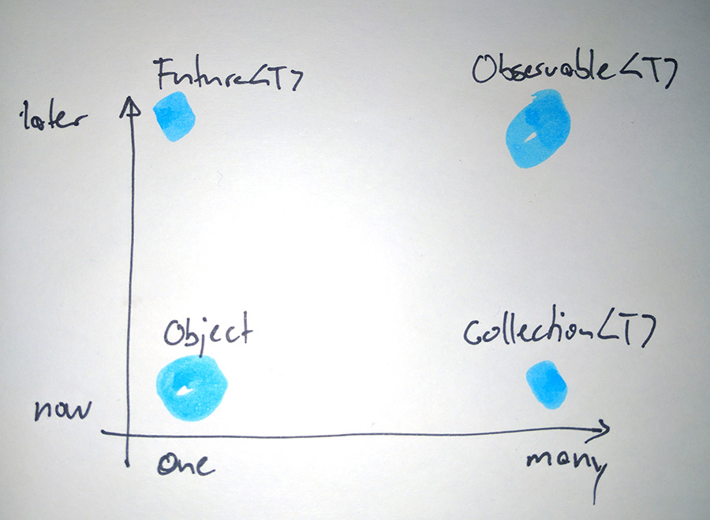

# RxJava.
# Or: How I learned to stop worrying and love the `Observable`

***

# You may know me from...

***

# Guava: Make Java great again.

***

# Gerrit: Honey, I shrunk the reviews

***

# 😊

***

# Rx-wat?

***

# Defintion

Es gibt viele gute, genaue, beliebig komplizierte Erklärungen und Definitionen...

- Reactive Manifesto: Manager
- Microsoft: Rx = Observables + LINQ + Schedulers: M$
- Erik Meijer: Your mouse is a database: Kreuzung von `Future<T>` und `AsyncCallback<T>` 

***

# TL;DR

```
Reactive programming is programming with asynchronous data streams.
```

***




***

# Was ist falsch mit 'jetzt'?

- Blockieren...
- Blockieren ist böse.

***

# Was ist falsch an Callbacks?

- Callback
- ... Hell!
- Koordination von mehreren super-messy
- Einen registrierten Callback abbrechen? `void doStuff(Callable<T> c)`
- Man will nur die ersten 100 Elemente...

***

# 💩

***

# Was ist mit Future<T>?

- Composen nicht (`peopleFuture().get().filter(p.age == 64)`?)
- Schwer mehrere Calls zu koordinieren
- Immer noch auf das Resultat warten: `.get()` blockiert

*** 

# Futures mit Callbacks

- Guava: `ListenableFuture`
- Java8: `CompletableFuture`
- Scala Futures

Besser.

Aber: Immer noch Callbacks...

***

# RxJava Observables

```java
class Observable<T> {
	Subscription subscribe(Observer<T> observer);
	...
}
```

```java
interface Observer<T> {
	void onNext(T item);
	void onCompleted();
	void onError(Throwable t);
}
```

***

# Verglichen mit...

- Observer Pattern
  - ähnlich, aber mit
  - `onComplete()`
  - `onError(e)`
- Iterator Pattern
  - Push statt Pull
- Futures
  - `Observable<T>` ist ein Stream von Items

***


***

# So what?

***

# Operators!!

- `filter(Func1<T, Boolean> predicate)`
- `skip(int number)`
- `take(int number)`
- `distinct()`
- `distinctUntilChanged()`
- `zip(Observable<A> as, Observable<B bs)`
- `merge(Observable<A> a1, Obervable<A> a2)`
- `debounce(long amount, TimeUnit unit)`
- `map(Func<T, R> f)`
- `flatMap(Func<R, Observable<R>> f)`
- `...`

***

# Zwei Passwortfelder

```java
Observable<String> firstPassword =
  RxTextView.textChangeEvents(password)
	.doOnNext(clearSecondPassword())
	.map(event -> event.text().toString())
	.filter(PasswordPolicy::isValidPassword);

Observable<String> secondPassword = ...;

Observable<Attempt> attempts = Observable
	.combineLatest(firstPassword, secondPassword, Attempt::new)
```

***

# Concurrency

- Single-threaded by default. RxJava erstellt nicht magisch neue Threads.
- `subscribeOn(scheduler)`: Aufruf der Subscription
- `observeOn(scheduler)`: Observing der Items

***

# Eingebaute `Scheduler`
- `Schedulers.computation()`: Pool mit Grösse `n` (CPU Cores)
- `.immediate()`: auf dem aktuellen Thread
- `.io()`: I/O bound, wachsender Pool
- `.trampoline()`: Queue auf aktuellem Thread
- `.test()`: Testing; Zeit 'steuerbar'
- ...

***

