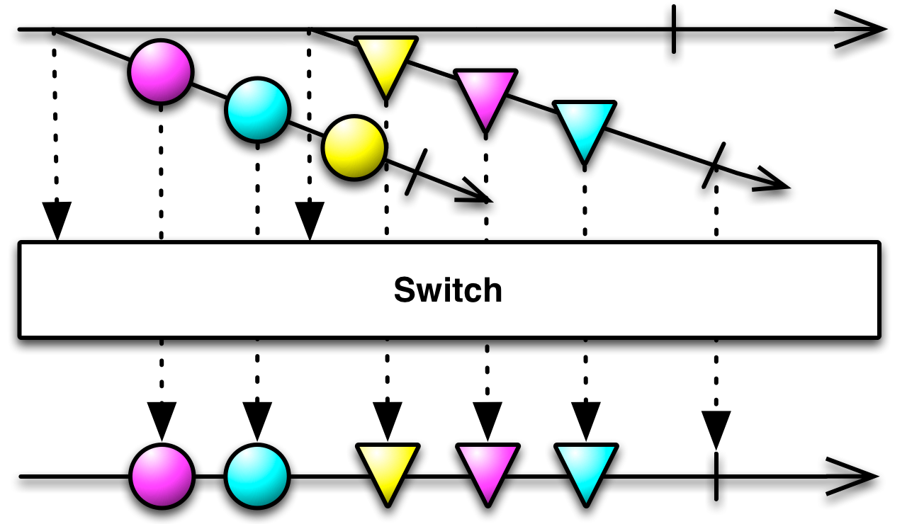

# RxJava.
# Or: How I learned to stop worrying and love the `Observable`

***


# 😊

***

# Rx-wat?

***

# Definition: Reactive programming

Es gibt viele gute, genaue, beliebig komplizierte Erklärungen und Definitionen...

- Reactive Manifesto: Manager
- Microsoft: Rx = Observables + LINQ + Schedulers: M$
- Erik Meijer: Your mouse is a database: Kreuzung von `Future<T>` und `AsyncCallback<T>` 

***

# TL;DR

```
Reactive programming is programming with asynchronous data streams.
```

***


***

# Was ist falsch mit 'jetzt'?

- Latenz. Alles dauert. (See: 'Life beyond the illusion of Present' @jboner)
- Blockieren...
- Blockieren ist böse.

***

# Was ist falsch an Callbacks?

- Callback
- ... Hell!
- Koordination von mehreren super-messy
- Einen registrierten Callback abbrechen? `void doStuff(Callable<T> c)`
- Man will nur die ersten 100 Elemente...

***

# 💩

***

# Was ist mit Future<T>?

- Einfach für eine Stufe concurrent Ausführung
- Immer noch auf das Resultat warten: `.get()` blockiert
- Composen nicht (`peopleFuture().get().filter(p -> p.age >= 64)`?)
- Schwer mehrere Calls zu koordinieren, vor allem wenn sie verschiedene Latenzen haben

*** 

# Futures mit Callbacks

- Guava: `ListenableFuture`
- Java8: `CompletableFuture`
- Scala Futures

Besser.

Aber: Immer noch Callbacks...

***

# RxJava Observables

```java
class Observable<T> {
	Subscription subscribe(Observer<T> observer);
	Subscription subscribe(Action1<T> onNext, Action1<Throwable> onError)
	... // ^--- Kann man canceln...
}
```

```java
interface Observer<T> {
	void onNext(T item);
	void onCompleted();
	void onError(Throwable t);
}
```

```
(onNext)? (onCompleted | onError)
```

***

# Verglichen mit...

- Observer Pattern
  - ähnlich, aber mit
  - `onComplete()`
  - `onError(e)`
- Iterator Pattern
  - Push statt Pull
- Futures
  - `Observable<T>` ist ein Stream von Items

***


***

# So what?

***

# Operators!!

- `filter(Func1<T, Boolean> predicate)`
- `skip(int number)`
- `take(int number)`
- `distinct()`
- `distinctUntilChanged()`
- `zip(Observable<A> as, Observable<B bs, Func<A, B, R> f)`
- `merge(Observable<A> a1, Obervable<A> a2)`
- `debounce(long amount, TimeUnit unit)`
- `map(Func<T, R> f)`
- `flatMap(Func<R, Observable<R>> f)`
- `...`

***

# Zwei Passwortfelder

```java
Observable<String> firstPassword =
  RxTextView.textChangeEvents(password)
	.doOnNext(clearSecondPassword())
	.map(event -> event.text().toString())
	.filter(PasswordPolicy::isValidPassword);

Observable<String> secondPassword = ...;

Observable<Attempt> attempts = Observable
	.combineLatest(firstPassword, secondPassword, Attempt::new)
```

***

# Concurrency

- Single-threaded by default. RxJava erstellt nicht magisch neue Threads.
- `subscribeOn(scheduler)`: Aufruf der Subscription
- `observeOn(scheduler)`: Observing der Items

***

# Eingebaute `Scheduler`

- `Schedulers.computation()`: Pool mit Grösse `n` (CPU Cores)
- `.io()`: I/O bound, wachsender Pool
- `.trampoline()`: Queue auf aktuellem Thread
- `.test()`: Testing; Zeit 'steuerbar'
- ...

***

# Search-As-You-Type

```java
// In der View/Activity
Observable<String> queryTexts = RxSearchView.queryTextChanges(search)
	.share()
    .map(eventToText())
    .startWith("");
```

***

# Search-As-You-Type (contd.)
```java
// Im Presenter
Observable<String> queryTexts = view.queryTexts()
	.debounce(500, MILLISECONDS)
	.distinctUntilChanged();

Observable<Filter> filters = view.filters();

Observable<DocumentQuery> queries =
	combineLatest(queryTexts, filters, DocumentQuery::new);
```
***

# Search-As-You-Type (contd.)

```java
// Repository, mit Retrofit
interface DocumentsRepository {
	Observable<Documents> documents(Observable<DocumentQuery> queries);
}

Observable<Documents> documents(Observable<DocumentQuery> queries) {
	return queries
		.map(q -> api.getDocuments(q))
		.flatMap(toDocuments())
		.subscribeOn(ioScheduler);
}
```

***

# Search-As-You-Type (contd.)

###	Problem
Der User tippt schon wieder, während wir auf den Request warten...

### Lösung
There's an operator for that.

***

# `Switch`

> Convert an Observable that emits Observables into a single Observable that emits the items emitted by the most-recently-emitted of those Observables.

***
# 😱

***


***

# 🤔  ⏱  🎉

*** 



***

# Search-As-You-Type (contd.)

```java
Observable<Documents> documents(Observable<DocumentQuery> queries) {
	return switchOnNext(
			queries.map(q -> api.getDocuments(q)
				.map(toDocuments())
				.subscribeOn(ioScheduler)
			)
		);
}
```
Jedes mal, wenn `queries` emitted, bevor `getDocuments()` completed, wird der Call unsubscribed und auf das nächste Resultat geswitched.

***

# Search-As-You-Type (contd.)
```java
// Im Presenter
documentsRepository.documents(queries)
	.map(toViewModels())
	.observeOn(uiScheduler)
	.subscribe(
		documents -> view.showDocuments(documents),
		error -> {
			view.showDialog("Failed to load documents.")
				.subscribe(okClicked -> resubscribe())
		}
	);
```

***

# 👍 🤘 🎉

***

# Okay, aber nicht _alles_ ist ein Stream...

`Single<T>` hilft: `onSuccess(t)`, `onError(e)`.

Wann:

- Eine Operation die mit genau _einem_ Wert abgeschlossen wird.
- `Observable` ist zu langsam für das Problem (gemessen!)
- Es ist schlicht und einfach _kein Stream_.

***

# And now?

***

# 💊

Take the red pill

***

# ReactiveX

- eine komplette Spez, unter anderem von Erik Meijer
- unabhängig von der Sprache
- RxJava, RxJS, Rx.NET, RxLua, RxSwift, RxKotlin, RxScala, ...

***

# RxJava

- initial Rx.NET
- Netflix schreibt erste Version RxJava (public Release ca. 2013)
- Netflix braucht RxJava unter anderem im Backend, weil das Frontend nutzt
- Passt aber auch super ins UI
- RxJava ist eine Implementation von Reactive Streams

***

# An operator a day keeps the doctor away.


***

# Fragen?

***

# 🐬

So long and thanks for all the fish!

***

# Links

- [ReactiveX](http://reactivex.io)
- [Reactive programming in the Netflix API](http://techblog.netflix.com/2013/02/rxjava-netflix-api.html)
- [Grokking RxJava, 3 Parts](http://blog.danlew.net/2014/09/15/grokking-rxjava-part-1/)
- [Life beyond the illusion of Present](https://www.youtube.com/watch?v=Nhz5jMXS8gE)
- Buch: [Reactive programming with RxJava](http://shop.oreilly.com/product/0636920042228.do) (2017)
