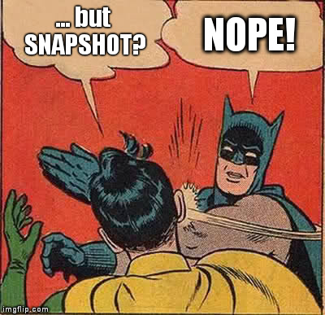

# EGG Versioning Plugin
## Versioning made stupidly easy
Silvio Heuberger, Ergon Informatik AG

***

# TL;DR

```java
apply plugin: 'egg-versioning'
```

***

# Der alte Weg

- `version.properties` einchecken
- Maven Release Plugin → SNAPSHOT-itis, automagisch erstellte Commits
- Shell Scripts die Files anfassen
- Sicher noch andere...

***

#Führt zu

- Müll in der History
	- Jeder Zwischenrelease muss tagged werden
	- Tags für Release
	- Nightly Builds
	- Deployments für Testing

*** 

# Führt zu (contd.)

- Kompliziertem Release-Job
	- Shell Script auf Jenkins
	- Jenkins ändert Files
	- Jenkins muss committen, pushen, ...
- Tags verschieben plötzlich attraktiv/nötig

***

# enter stage right: `git describe`

***

# `git describe`

`git` definiert sowieso schon zu jedem Zustand der History einen eindeutigen Identifier: den Commit-Hash

```
04afafa
```

Dieser Hash reicht aus, um genau diesen Zustand widerspruchsfrei in der History zu identifizieren.

Nachteil: Er ist nicht besonders human-readable.

***

# `git describe`

`git describe` kann aber auch etwas smarter sein:

- Tags auswerten um den Identifier anzureichern
- mit Patterns auf besondere Tags matchen
- rausfinden ob der Build tatsächlich reproduzierbar ist
- auch für Feature-Branches

***

# `git describe`

Aus was setzt sich die Version zusammen?

`git describe --long` ergibt:

```
1.2.0-1-g258101a
^     ^  ^
|     |  |_______ Hash des aktuellen Zustands
|     |__________ Wieviele Commits 'voraus' gegenüber dem Tag
|________________ Letzter gematchter Tag
```

Ohne `--long` ergibt sich (wenn man genau auf einem Tag 'sitzt') nur die Version: `1.2.1`

***

# egg-versioning: was bringt's?

- Ein Wrapper um `git describe` mit 'schlauen' Defaults
- Keine Files müssen mehr angepasst werden
- Version ist via `git describe` widerspruchsfrei definiert
- Tags und History definieren die Version der Artefakte
- `version.properties` für alle Artefakte automatisch definiert; auf dem Klassenpfad
- `gradle describeVersion` zeigt die Version an, die aktuell entstehen würde, wenn man das Artefakt baut

***

# Kurze Demo

***

# Optionen
```gradle
ergon.versioning {
	match = "database-*"
}
```

Prefix-Matching auf Tags, falls mehrere Projekte/Artefakte in einem git-Repo zusammen sind.

***

# Optionen
```gradle
ergon.versioning {
	annotatedTagsOnly = true
}
```

Nur annotated Tags fliessen in die berechnete Version ein.

***

# Optionen
```gradle
ergon.versioning {
	firstParentOnly = true
	longFormat = true
	replaceGlobWith = { match, tag ->
		"do-some-magic-${tag}"
	}
}
```
Besonders die letzte interessant:

- Default: Trimt Prefix aus `match`
- Custom: Closure mit zwei Parametern, soll einen String zurückgeben.

***

# SNAPSHOT

Was ist jetzt genau mit SNAPSHOT?

***



_Existiert nicht mehr._

***

# Die aktuellste Version tracken

```gradle
dependencies {
	compile "ch.ergon.sample:database-api:1.2.+"
}
```

Gradle macht auf der letzten Stelle *semantic Versioning*.

- `1.2.1` ist neuer als `1.2.0`
- `1.2.1` ist neuer als `1.2.0-10-abfggd`
- `1.2.1-2-5efgb` ist neuer als `1.2.1`

***

# `-dirty`

`egg-versioning` hängt `-dirty` an wenn das Working Directory nicht clean ist.

Faktisch ist dieser Build nicht reproduzierbar via:

1. `git clone ${repo} && git checkout ${tag}`
2. `gradle makeMeASandwich`

Lösen via `.gitignore`.

***

# Bonus: Feature Branches

- Branch am Anfang taggen.
- Versionen die entstehen
	- `feature/with-completion-3-abdc5`
	- `feature/extract-user-data-5-55621`
- Funktioniert auch mit Bugfix-Branches die bei einem Tag anfangen.


***

# Bonus: Releasing

1. `git tag 1.2.2`
2. `git push --tags`
3. Release Job starten mit `1.2.2`
4. Rinse, repeat.

*** 

# Bonus: Releasing

Intermediate Version publishen?
1. Release Job starten.

***

# Bonus: `version.properties`

Auf dem Klassenpfad:

```
# File generated by build.
build.date=Wed Sep 23 14:15:07 CEST 2015
build.host=Linux - amd64 - 4.1.6-1-ARCH
build.java.version=1.8.0_60
build.java.vm.vendor=Oracle Corporation
build.application=database-api
build.version=0.0.3-3-gd4d087f
```

***

# Fragen?
